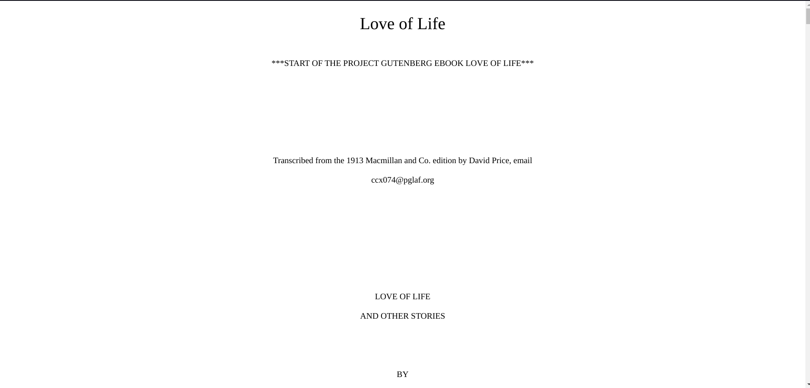
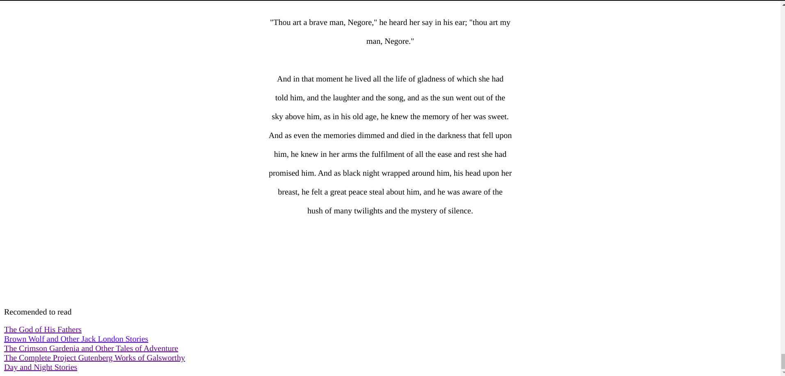

# LetMeTellYouAStory

- This project is based on the short stories from [1002-short-stories](https://www.kaggle.com/datasets/shubchat/1002-short-stories-from-project-guttenberg?resource=download) dataset which are taken from [Project Gutenberg](https://www.gutenberg.org/).

- The processing part can be found in the [short-stories-classification.ipynb](https://github.com/SandeepUrankar/LetMeTellYouAStory/blob/main/short-stories-classification.ipynb) or in the [Kaggle](https://www.kaggle.com/code/sandeepcodes/short-stories-classification/notebook).

- Clone this repository by running the command -

```git
git clone https://github.com/SandeepUrankar/LetMeTellYouAStory.git
```

- Open the terminal/cmd and type -
```bash
python3 stories.py
```

- Select the category of story you want to read. Type the number of the category and press Enter.
```
Choose the category of story which you want to read...
0 - Sociology Fiction
1 - Love Fiction 
2 - Fiction
3 - Fairy Tales
4 - Science Fiction
5 - Classics
6 - Literature
7 - Literary fiction
8 - Detective Fiction
9 - Fantasy 
10 - Romance Literature 
11 - Historical Fiction
12 - Villages Fiction
13 - Fantasy Fiction
14 - Political Fiction
15 - Classical Fiction
16 - Childrens Fiction
17 - Horror
18 - Science fiction
```
- Now select the title of the story of which you want to read. Select the number and press Enter. (I have choosen Classics.)
```
Classics it is !
Choose a story -
0 -  How Tell a Story and Others
1 -  A Child's Dream of a Star
2 -  Crucial Instances
3 -  The Old Manse (From "Mosses From An Old Manse")
4 -  Sandburrs and Others
5 -  Roads of Destiny
6 -  The Sunny Side
7 -  Droll Stories, Complete
8 -  The Snow Image
9 -  Twice Told Tales
10 -  Dubliners
11 -  The Black Monk and other Stories
12 -  Earth’s Holocaust (From “Mosses From An Old Manse”)
13 -  The Awakening and Selected Short Stories
14 -  The Grain Ship
15 -  Stories from Tagore
16 -  The Mansion
17 -  Love of Life
```

- After selecting the story, a browser window will be opened containing the story you have choosed.



- Read the story and at the end of the stories you will find the recommendations of stories to read further, click on the recommended story name and that story will be displayed in the browser tab.



- To stop the flask server, navigate back to terminal/cmd and press -
```
ctrl + c
```


#### Thanks to  [Readnet by Shubchat](https://github.com/shubchat/Readnet)


### Suggestions/Improvements -
- Create an [issue](https://github.com/SandeepUrankar/LetMeTellYouAStory/issues/new/choose) and let me know, Thanks.
